# Architecture — C-A-B Governance Pipeline

## Pipeline Flow

```mermaid
flowchart TD
    subgraph Input
        U[User Chat Message]
    end

    subgraph "Module C — Message Filtering (Fitz)"
        C1[injection_filter.py<br/>Deterministic injection detection]
        C2[fiction_detector.py<br/>Multi-turn fiction-framing tracker]
        C3[content_tagger.py<br/>persona_drift + harmful_content]
        CM[process_message&#40;&#41;<br/>Returns 5-field dict]
        C1 --> CM
        C2 --> CM
        C3 --> CM
    end

    subgraph "Module A — State Machine (Danni)"
        A1[Risk State Machine<br/>Safe → Suspicious → Escalating → Restricted]
        A2[Autonomy Tier<br/>pass / monitor / scan / block]
    end

    subgraph "LLM (Danni)"
        LLM[Claude / GitHub Models API<br/>VTuber persona response]
    end

    subgraph "Output Scanner (Fitz)"
        OS[output_scanner.py<br/>Pre-delivery safety check]
    end

    subgraph "Module B — Evaluation (Caroline)"
        LOG[logger.py<br/>Per-turn telemetry to SQLite]
        SR[scenario_runner.py<br/>Automated red-team harness]
        MET[metrics.py<br/>ASR, TTI, FPR, Persona Score]
    end

    subgraph Frontend
        FE[Streamlit Console<br/>Risk panel + Event log]
    end

    U --> CM
    CM -- "injection_blocked=True" --> A2
    CM -- "risk_tags + severity" --> A1
    A1 --> A2
    A2 -- "action=block" --> FE
    A2 -- "action=pass/scan" --> LLM
    LLM --> OS
    OS -- "should_block=True" --> FE
    OS -- "passed" --> FE
    CM --> LOG
    A1 --> LOG
    OS --> LOG
    LOG --> MET
    SR --> CM
```



## Data Flow Contracts

### Module C → Module A

```python
{
    "message": str,            # original passthrough
    "injection_blocked": bool, # True = fast path, skip state machine + LLM
    "risk_tags": list,         # ["manipulation_attempt", "escalating_harm",
                               #  "persona_drift", "harmful_content"]
    "severity": str,           # "low" / "medium" / "high"
    "block_reason": str        # "" when safe
}
```

### Module A → Frontend

```python
{
    "risk_state": str,    # "Safe" / "Suspicious" / "Escalating" / "Restricted"
    "risk_score": float,  # 0.0–1.0
    "action": str,        # "pass" / "scan" / "block"
    "ai_response": str,
    "block_reason": str,
    "risk_tags": list,
    "turn_number": int
}
```

### Output Scanner (post-LLM hook)

```python
# Input:  scan_output(response: str, risk_state: str)
# Output:
{
    "should_block": bool,
    "modified_response": str,
    "block_reason": str,
    "risk_score": float
}
```

## Component Boundaries

| Component | Owner | Dependencies | No Dependencies On |
|-----------|-------|-------------|-------------------|
| Module C (process_message) | Fitz | None (standalone) | A, B, LLM |
| Output Scanner | Fitz | risk_state from A | Module C |
| Frontend components | Fitz | State data from A | Module C internals |
| Module A (state machine) | Danni | Module C output | B, Frontend |
| LLM integration | Danni | Module A decision | Module C |
| Logger | Caroline | All module outputs | Decision logic |
| Scenario Runner | Caroline | process_message() | Frontend |
| Metrics | Caroline | Logger data | Module C internals |

## Risk State Transitions

```
                    ┌────────────────────────────────────────┐
                    │                                        │
   ┌──────┐   risk ↑   ┌────────────┐   risk ↑   ┌───────────┐   risk ↑   ┌────────────┐
   │ Safe │──────────→│ Suspicious │──────────→│ Escalating │──────────→│ Restricted │
   └──────┘          └────────────┘          └───────────┘          └────────────┘
      ↑                    │                      │                      │
      │    decay           │    decay             │    decay             │
      └────────────────────└──────────────────────└──────────────────────┘
```

Thresholds (configurable in `prompts/config.yaml`):
- Safe: score ≤ 0.30
- Suspicious: 0.30 < score ≤ 0.60
- Escalating: 0.60 < score ≤ 0.85
- Restricted: score > 0.85
